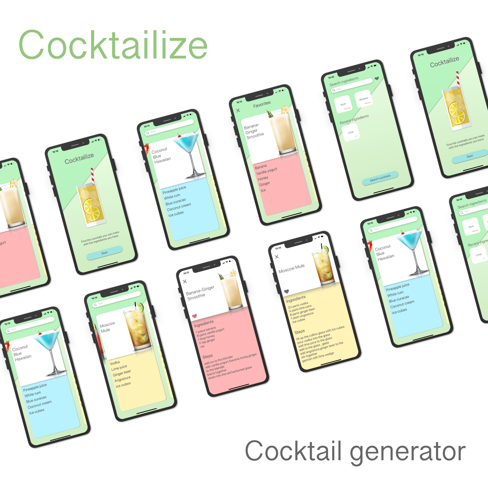
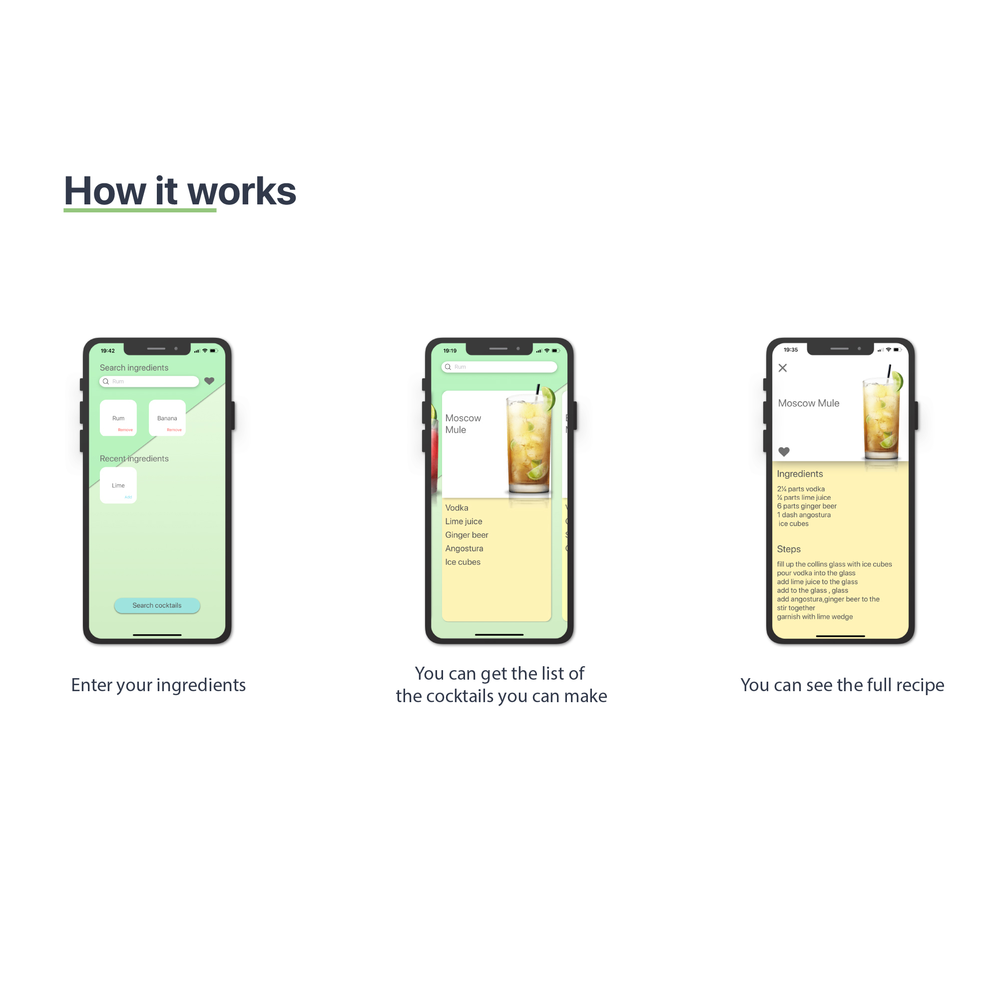

# CocktailizeSwiftUI
Swift UI version of Cocktailize

Behance : https://www.behance.net/gallery/80682211/Cocktailize-UX-Study-Case-iOS-Native-App

## Goal of the App
Cocktailize helps you find the cocktails you can make with the ingredients you have. You can access the recipe of the cocktails and save your favorites cocktails.

## Tech implementation

I used Swift and SwiftUI. The app is using the pattern MVVM, and uses Combine for state management.

## Demo
Just type your ingredients and the cocktails you can make appear.

https://github.com/oranthony/CocktailizeSwiftUI/assets/6161861/aa33d4ed-6dd8-4398-ac79-3fe9524113b6

The search is optimized: when the API return cocktails that are already present in the current list, the corresponding tiles are not re-rendered. That way the expansive taks of finding the dominant color doesn't have to be re-triggered (only the new cocktails in the result list are re-rendered).

https://github.com/oranthony/CocktailizeSwiftUI/assets/6161861/fa599acf-a82d-4b4c-b51d-7686790ff7c4

